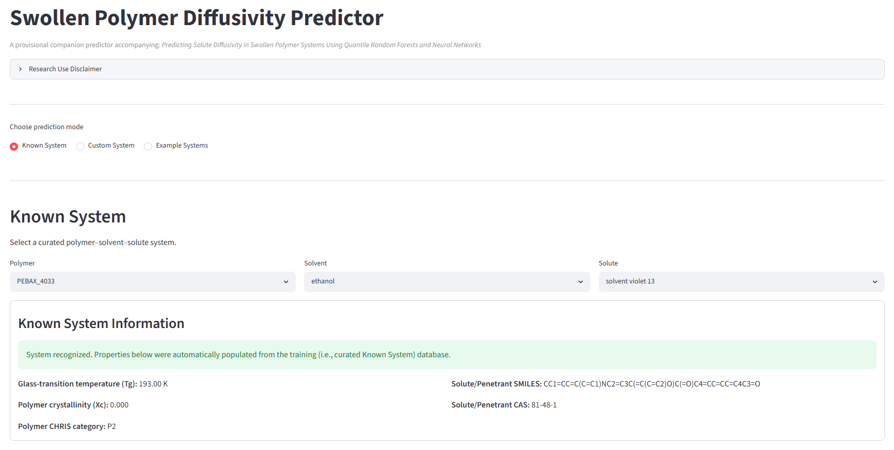

# Swollen Polymer Diffusivity Predictor

*A provisional companion predictor accompanying*

> **Predicting Solute Diffusivity in Swollen Polymer Systems Using Quantile Random Forests and Neural Networks**

---

## Overview



The **Swollen Polymer Diffusivity Predictor** provides an interactive implementation of the quantile random forest (QRF) and multilayer perceptron (MLP) models trained and developed in the current work for predicting solute diffusivity in swollen polymer systems.

The companion predictor is intended to facilitate:

- manuscript reproducibility
- exploratory analysis
- educational use
- rapid evaluation of polymer–solute–solvent systems

The predictor accepts experimentally measurable quantities through a simplified interface and automatically generates the complete feature set required by the machine-learning models in the current work.

---

## Prediction Modes

### Known System

Known System mode provides a guided interface for polymer–solute–solvent combinations contained within the curated reference database derived from the modeling dataset used to train the machine-learning models in the current work.

Users select:

- Polymer
- Solvent
- Solute

The predictor automatically populates:

- Glass-transition temperature (Tg)
- Polymer crystallinity (Xc)
- CHRIS category
- Solute SMILES
- Solute CAS number

The user supplies only:

- Temperature
- Swollen/dry mass ratio
- Polymer density
- Solvent density

---

### Custom System

Custom System mode accepts the simplified predictor interface used by the reference prediction engine in the current work.

Required inputs include:

- Temperature
- Glass-transition temperature
- Swollen/dry mass ratio
- Polymer density
- Solvent density
- Polymer crystallinity
- CHRIS category
- SMILES (preferred)

or

- CAS number

The predictor automatically computes all remaining descriptors internally.

---

## Prediction Outputs

Predictions are generated independently using both machine-learning frameworks in the current work.

### Quantile Random Forest (QRF)

The QRF prediction distribution is derived from prediction variability across the 300 trees comprising the random forest in the current work.

Reported quantities include:

- 5th percentile
- Median (50th percentile)
- 95th percentile

---

### MLP Ensemble

The MLP prediction distribution is derived from prediction variability across an ensemble of twenty independently trained neural networks initialized using different random seeds.

Reported quantities include:

- 5th percentile
- Median (50th percentile)
- 95th percentile

---

## Prediction Sampling

The predictor additionally generates empirical prediction samples suitable for downstream statistical analyses.

### QRF sampling

QRF samples are generated by bootstrap sampling from tree-level prediction variability within the random forest in the current work.

### MLP sampling

MLP samples are generated by bootstrap sampling from prediction variability across the neural-network ensemble in the current work.

The requested number of samples may exceed the number of trees or ensemble members because bootstrap sampling is performed with replacement.

Downloaded CSV files include:

- user inputs
- computed descriptors
- prediction summaries
- generated QRF samples
- generated MLP samples

allowing direct integration into downstream uncertainty propagation and Monte Carlo workflows.

---

## Research Use Disclaimer

This provisional companion predictor accompanies the manuscript

> **Predicting Solute Diffusivity in Swollen Polymer Systems Using Quantile Random Forests and Neural Networks** [Citation details will provided as soon as they become available.]


It is provided by the authors to facilitate reproducibility, exploratory analysis, educational use, and application of the machine-learning models in the current work.

The predictor is a provisional research implementation and is **not** an FDA-qualified Regulatory Science Tool (RST), Medical Device Development Tool (MDDT), or FDA-approved decision-support tool.

Predictions generated by this predictor should not replace experimental measurements, engineering judgment, or established regulatory evaluation procedures.

The findings and conclusions in the accompanying manuscript are those of the authors and do not necessarily represent any determination or policy of the U.S. Food and Drug Administration. The mention of commercial products, their sources, or their use in connection with material reported therein is not to be construed as either an actual or implied endorsement of such products by the Department of Health and Human Services.

Information regarding FDA-qualified tools is available through:

- **CDRH Regulatory Science Tool (RST) Catalog**  
  https://cdrh-rst.fda.gov/

- **Medical Device Development Tool (MDDT) Program**  
  https://www.fda.gov/medical-devices/medical-device-development-tools-mddt

---

## Repository Structure

```
app.py

predictor/
    reference/
    predict.py
    known_system.py
    descriptors.py
    interpretation.py
    downloads.py

data/

examples/

docs/
```

---

## Citation

If this companion predictor contributes to your work, please cite:

> **Predicting Solute Diffusivity in Swollen Polymer Systems Using Quantile Random Forests and Neural Networks** [Citation details will provided as soon as they become available.]

---

## Current Status

Current development milestone:

**Version 1.0**

- Product Design Specification completed
- Wireframes completed
- Software architecture completed
- Reference prediction engine integrated
- QRF models integrated (from the present work)
- MLP ensemble integrated (from the present work)
- Known System database integrated
- Real-time prediction sampling implemented

Future releases will continue to expand the curated Known System database and additional transport-property prediction capabilities while preserving the frozen reference prediction engine accompanying the manuscript.